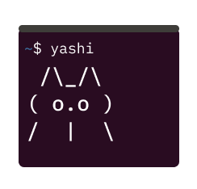

## Intro




Are you a person who had trouble remembering shell commands and flags for all shell commands? This is yet another helper that 
can make the shell more human-friendly. Just say what to do, not remember. 

## Usage

Set env variable `SHAI_COHERE_KEY`

## Build 

Just run make. Distributive will be assembled and placed into ./dist folder
```
make
```

